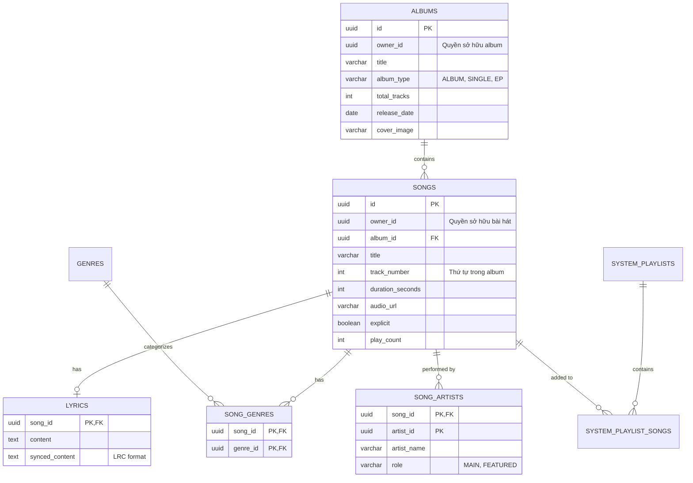

# Phân tích Yêu cầu và Đề xuất Kiến trúc Database (Catalog Service)

Dựa trên cấu trúc hiện tại của `mc_music_catalog_schema` (chỉ gồm `genres`, `albums`, `songs`), cơ sở dữ liệu đang khá đơn giản và đúng là sẽ gặp nhiều hạn chế khi dự án mở rộng. Dưới đây là phân tích chi tiết về các tính năng cần có, các API tương ứng, và đề xuất cải tiến Database để đáp ứng một ứng dụng nghe nhạc chuyên nghiệp (như Spotify, Apple Music).

---

## 1. Phân tích Chức năng Dưới góc độ Người dùng (User-facing Features)

Để mang lại trải nghiệm nghe nhạc toàn diện, người dùng sẽ mong đợi các nhóm tính năng sau:

### 1.1. Khám phá & Tìm kiếm (Discovery & Search)
- **Tìm kiếm đa năng (Global Search):** Tìm kiếm theo tên bài hát, tên album, tên nghệ sĩ hoặc thậm chí là một đoạn lời bài hát.
- **Khám phá theo danh mục:** Duyệt nhạc theo Thể loại (Pop, Rock, Indie), Tâm trạng (Chill, Buồn, Tập workout), hoặc Quốc gia.
- **Bảng xếp hạng (Charts):** Top 50 thịnh hành, Top 100 theo tuần.
- **Playlist do hệ thống quản lý (Editorial Playlists):** Các playlist do admin tạo ra (Ví dụ: "Nhạc Việt Ngày Mới", "K-Pop Daebak").

### 1.2. Trải nghiệm Nghe nhạc (Playback)
- **Hiển thị Lời bài hát (Lyrics):** Lời bài hát tĩnh hoặc lời bài hát chạy chữ đồng bộ với nhạc (karaoke/synced lyrics).
- **Thứ tự bài hát trong Album:** Phát chuẩn xác theo tracklist của một album.
- **Nghệ sĩ hợp tác (Feat.):** Thấy rõ các nghệ sĩ cùng góp giọng trong một bài hát, và có thể bấm vào từng nghệ sĩ để xem hồ sơ của họ.

### 1.3. Trang Hồ sơ Nghệ sĩ (Artist Profile)
- **Top Tracks:** Danh sách 5-10 bài hát phổ biến nhất của nghệ sĩ đó.
- **Discography:** Danh sách Album, EP, Single nghệ sĩ đã phát hành, được phân loại rõ ràng.
- **Appears On:** Những album hoặc bài hát của nghệ sĩ khác mà nghệ sĩ này được mời hát cùng (Feat).

---

## 2. API Cần thiết (Dưới góc độ Developer)

Để phục vụ các tính năng trên, Catalog Service cần cung cấp bộ API nội bộ và public (thông qua Gateway) rất phong phú:

### 2.1. API Duyệt nhạc (Browse APIs)
- `GET /api/catalog/browse/new-releases`: Lấy danh sách album/single mới phát hành.
- `GET /api/catalog/browse/genres`: Lấy danh sách thể loại.
- `GET /api/catalog/browse/genres/{genreId}/top-songs`: Lấy nhạc hot theo thể loại.
- `GET /api/catalog/browse/playlists`: Lấy danh sách Playlist do hệ thống quản lý (System Playlists).

### 2.2. API Tìm kiếm (Search APIs)
- `GET /api/catalog/search?q={keyword}&type={song,album,artist}`: Hỗ trợ Full-text search, trả về mixed data (gồm cả bài hát, album và thông tin nghệ sĩ).

### 2.3. API Chi tiết (Detail APIs)
- `GET /api/catalog/songs/{id}`: Lấy siêu dữ liệu chi tiết của 1 bài hát.
- `GET /api/catalog/songs/{id}/lyrics`: Lấy lời bài hát.
- `GET /api/catalog/albums/{id}/tracks`: Lấy danh sách bài hát trong 1 album (cần được sắp xếp theo đúng `track_number`).
- `GET /api/catalog/artists/{id}/top-tracks`: Tính toán và trả về top bài hát của nghệ sĩ (dựa trên `play_count`).
- `GET /api/catalog/artists/{id}/albums`: Lấy danh sách album chia theo loại (Album, Single/EP).

---

## 3. Đề xuất Mở rộng Database (`mc_music_catalog_schema`)

Dựa trên thiết kế ban đầu, ta nhận thấy các nhược điểm:
1. **Thiếu hỗ trợ đa nghệ sĩ:** Một bài hát có thể có ca sĩ chính và ca sĩ hát đệm (Feat). Cột `artist_id` cứng trong bảng `songs` không giải quyết được vấn đề này.
2. **Thiếu số thứ tự track:** Trong bảng `songs` không có cột chỉ định thứ tự bài hát trong album.
3. **Thiếu loại phát hành:** Bảng `albums` không phân biệt được đâu là Album đầy đủ, đâu là Single (1 bài), hay EP.
4. **Thiếu không gian cho Lời bài hát & Playlist hệ thống.**

> [!TIP]
> Việc giữ Data Denormalization (`artist_name` trong các bảng) là tốt để tối ưu query, nhưng ta cần cấu trúc lại quan hệ giữa bài hát và nghệ sĩ.

Dưới đây là các bảng (và cột) đề xuất thêm/sửa vào `catalog_db`:

### 3.1. Nâng cấp bảng `albums`
- Bổ sung `album_type`: `VARCHAR(20)` (VD: 'ALBUM', 'SINGLE', 'EP').
- Bổ sung `total_tracks`: `INT` (Số lượng bài hát trong album).

### 3.2. Nâng cấp bảng `songs`
- Đổi tên cột `artist_id` thành `owner_id`: `UUID` (Dùng để xác định nghệ sĩ đã tải bài hát lên và có quyền quản trị/sửa/xóa bài hát này. Các ca sĩ hát chung/Feat sẽ không có quyền này).
- Bỏ cột `artist_name` trong bảng này vì đã có bảng `song_artists` lo việc hiển thị danh sách tên nghệ sĩ.
- Bổ sung `track_number`: `INT` (Thứ tự bài hát trong album).
- Bổ sung `explicit`: `BOOLEAN` (Đánh dấu nhạc có ngôn từ mạnh).
- (Tuỳ chọn) Bổ sung `duration_ms` thay vì `duration_seconds` để độ chính xác cao hơn.

### 3.3. Thêm bảng `song_artists` (Quan hệ nhiều-nhiều)
Xử lý bài toán "Bài hát có nhiều ca sĩ hát chung".
- `song_id`: `UUID`
- `artist_id`: `UUID`
- `artist_name`: `VARCHAR(255)` (Denormalized)
- `role`: `VARCHAR(50)` (VD: 'MAIN', 'FEATURED', 'PRODUCER')
- *Primary Key (song_id, artist_id)*

### 3.4. Thêm bảng `lyrics` (Lời bài hát)
Nên tách riêng để tối ưu hiệu suất khi truy vấn danh sách nhạc, vì text lời bài hát thường rất dài.
- `song_id`: `UUID` (Primary Key)
- `content`: `TEXT` (Lời bài hát dạng plain text)
- `synced_content`: `TEXT` (Lời bài hát dạng LRC - có timestamp để hát karaoke)
- `language`: `VARCHAR(10)`

### 3.5. Thêm bảng `system_playlists` và `system_playlist_songs`
Mặc dù User Playlists được lưu ở `users_db`, Catalog Service cần quản lý các Playlist của nền tảng (Ví dụ: Top 50, Nhạc Mới).
- **`system_playlists`**: `id`, `name`, `description`, `cover_image`, `created_by_admin_id`
- **`system_playlist_songs`**: `playlist_id`, `song_id`, `added_at`, `position_order` (để sắp xếp thứ tự)

### 3.6. Thêm bảng `song_genres` (Quan hệ nhiều-nhiều)
Một bài hát thường thuộc nhiều thể loại khác nhau (Ví dụ: vừa là Pop, vừa mang âm hưởng R&B). Ta sẽ thiết kế bảng trung gian `song_genres (song_id, genre_id)` để giải quyết việc phân loại đa thể loại, giúp bộ lọc tìm kiếm trên giao diện trực quan và chính xác hơn.

---

## Tổng kết Lược đồ Đề xuất (ERD Mở rộng)

Bằng cách áp dụng các thay đổi này, Database của Catalog sẽ linh hoạt và mạnh mẽ hơn rất nhiều, hoàn toàn đủ sức phục vụ các dự án quy mô lớn. Bạn có muốn tôi tiến hành cập nhật lại script `init-docker.sql` với cấu trúc mới này không?
